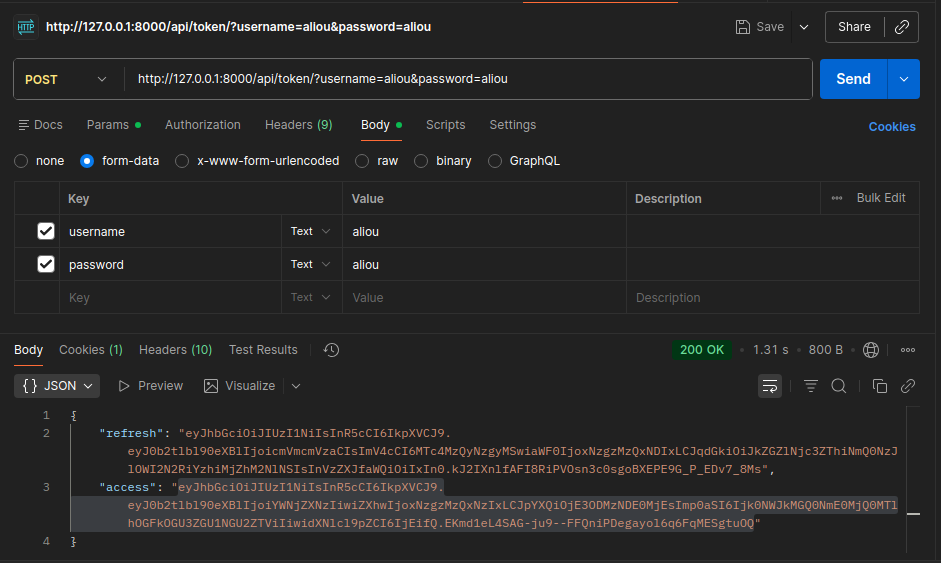

# Eco-Stock API

API REST développée avec **Django REST Framework** pour la gestion de stocks alimentaires.

Ce projet a été réalisé dans le cadre d'un TP backend ayant pour objectif de concevoir une API sécurisée permettant la gestion d'entrepôts et de produits alimentaires, ainsi que l'implémentation de règles métier spécifiques.

---

## Fonctionnalités

- Gestion des entrepôts (CRUD)
- Gestion des produits (CRUD)
- Relation **1-N** entre Warehouse et Product
- Déplacement d'un produit entre deux entrepôts
- Audit d'un entrepôt
- Authentification JWT
- Documentation OpenAPI / Swagger

---

## Technologies utilisées

- Python 3
- Django
- Django REST Framework
- Simple JWT
- drf-spectacular (Swagger/OpenAPI)
- SQLite

---

## Structure du projet

```
Eco-Stock/
│
├── api/
│   ├── models.py
│   ├── serializers.py
│   ├── views.py
│   ├── urls.py
│
├── config/
│   ├── settings.py
│   ├── urls.py
│
├── requirements.txt
└── README.md
```

---

# Installation

## Cloner le projet

```bash
git clone https://github.com/BigLineDev0/eco-stock-api.git
```

```bash
cd eco-stock-api
```

Créer un environnement virtuel

```bash
python -m venv .venv
```

Activation

Linux / macOS

```bash
source .venv/bin/activate
```

Windows

```bash
.venv\Scripts\activate
```

Installer les dépendances

```bash
pip install -r requirements.txt
```

Appliquer les migrations

```bash
python manage.py migrate
```

Créer un super utilisateur

```bash
python manage.py createsuperuser
```

Lancer le serveur

```bash
python manage.py runserver
```

---

# Authentification JWT

Obtenir un token

```
POST /api/token/
```

Body

```json
{
    "username": "username",
    "password": "motdepasse"
}
```

Réponse

```json
{
    "refresh": "...",
    "access": "..."
}
```

Ajouter ensuite le token dans l'en-tête :

```
Authorization: Bearer <access_token>
```

---

# Documentation OpenAPI

Swagger

```
http://127.0.0.1:8000/api/docs/
```

OpenAPI Schema

```
http://127.0.0.1:8000/api/schema/
```

ReDoc

```
http://127.0.0.1:8000/api/redoc/
```

---

# Endpoints

## Warehouse

| Méthode | Endpoint | Description |
|----------|----------|-------------|
| GET | `/api/warehouses/` | Liste des entrepôts |
| POST | `/api/warehouses/` | Créer un entrepôt |
| GET | `/api/warehouses/{id}/` | Détail d'un entrepôt |
| PUT | `/api/warehouses/{id}/` | Modifier un entrepôt |
| DELETE | `/api/warehouses/{id}/` | Supprimer un entrepôt |
| GET | `/api/warehouses/{id}/audit/` | Audit de l'entrepôt |

---

## Product

| Méthode | Endpoint | Description |
|----------|----------|-------------|
| GET | `/api/products/` | Liste des produits |
| POST | `/api/products/` | Créer un produit |
| GET | `/api/products/{id}/` | Détail d'un produit |
| PUT | `/api/products/{id}/` | Modifier un produit |
| DELETE | `/api/products/{id}/` | Supprimer un produit |
| POST | `/api/products/{id}/move/` | Déplacer un produit |

---

# Exemple : Déplacement d'un produit

Requête

```
POST /api/products/3/move/
```

Body

```json
{
    "warehouse": 2
}
```

Réponse

```json
{
    "message": "Produit déplacé avec succès.",
    "product": "Lait",
    "new_warehouse": "Entrepôt Dakar"
}
```

---

# Audit d'un entrepôt

Requête

```
GET /api/warehouses/2/audit/
```

Réponse

```json
{
    "warehouse": "Entrepôt Dakar",
    "location": "Dakar",
    "capacity": 100,
    "total_products": 35
}
```

---

# Règles métier

Le déplacement d'un produit est autorisé uniquement si :

- le produit existe ;
- le produit n'est pas périmé ;
- l'entrepôt de destination existe ;
- l'utilisateur est authentifié.

Dans le cas contraire, l'API retourne un code HTTP approprié (`400`, `401` ou `404`).

---

# Flux métier 

Un schéma explicatif de la requête de transfert détaillant la validation métier.

```
                    Client (Postman / Swagger)
                              │
                              │
               POST /api/products/{id}/move/
                              │
                              ▼
                    ProductViewSet.move()
                              │
                              ▼
              Récupération du produit (get_object)
                              │
                              ▼
           Le produit est-il périmé ?
                 │                    │
               Oui                   Non
                 │                    │
                 ▼                    ▼
          400 Bad Request      Validation du Serializer
                                      │
                                      ▼
                  L'entrepôt existe-t-il ?
                          │                  │
                        Non                 Oui
                          │                  │
                          ▼                  ▼
                  400 Bad Request     Mise à jour du produit
                                             │
                                             ▼
                                       product.save()
                                             │
                                             ▼
                                      200 OK + Message

```

---

## Capture d'ecrans test des Endpoints sur Postman

# Authentification JWT



---

# EndPoint Product

- Liste  des produits


- Creer un produit


- Modifier un produit


- Supprimer un produit


- Deplacer un produit


---

# EndPoint Warehouse

- Liste des entrepôts


- Créer un entrepôt


- Modifier un entrepôt


- Supprimer un entrepôt


- Audit de l'entrepôt


# Auteur

- Aliou DIALLO